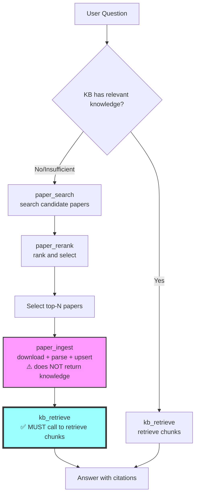

# Paper Expert

Use this skill when the user asks for:
- latest papers in a domain
- paper survey / literature review / SOTA comparison
- evidence-backed technical answers with citations

## Workflow

1. Clarify scope quickly:
- domain/sub-domain
- time range (default last 12 months)
- paper type (theory, method, benchmark, application)

2. Retrieve candidate papers:
- Prefer `kb_retrieve` first for paper/technical questions.
- Only trigger `paper_search` when KB evidence is insufficient (e.g., no hits or low-confidence top hits).
- Do not include irrelevant words, such as "recent", in your query.
- Use direct web search fallback only when `paper_search` is unavailable/fails.
- `paper_search` includes complete retrieval process including `paper_similarity` and `paper_rerank`.
- Choose a relatively large value for `search_topk` (such as 50) to search for a diverse range of papers.

3. Score and rerank:
- If you need, use `paper_similarity` and `paper_rerank` to calculate the similarities between the query and candidate papers.
- If you use `paper_search`, it already includes these steps, so no need to call them separately.

4. Ingest papers to knowledge base (when KB needs enrichment):
- Call `paper_ingest` to download, parse, and upsert papers to local KB.
- **This tool prepares papers for retrieval but does NOT return knowledge directly.**
- Use `paper_ingest` instead of `web_fetch` to download papers from arxiv.
- **After ingestion completes, you MUST call `kb_retrieve` to retrieve relevant chunks if you lack relevant knowledge.**

5. Retrieve from KB and answer with evidence:
- **ALWAYS call `kb_retrieve` after `paper_ingest` to get grounded evidence.**
- Call `kb_retrieve` when answering domain questions that need citations.
- Every key claim should include citations (paper_id + title + url or chunk_id).
- If both KB and web results exist, prioritize KB-grounded evidence.

**Complete Workflow Diagram**:

## Output Template

When returning paper results, include:
- Query strategy
- Candidate pool summary
- Final ranked list (top N)
- Why selected
- Known limitations / uncertainty

When answering a technical question, include:
- Short answer
- Evidence bullets with citations
- If evidence is insufficient, explicitly say so

## Failure and Fallback

- If no high-confidence papers found:
  - broaden keywords
  - relax time range
  - explain retrieval limits
- If tool fails:
  - retry with smaller batch
  - fallback to web-based path
- If `paper_search` or rerank returns non-empty results, do NOT claim "no research exists".
  Instead report uncertainty as "insufficient confidence" and list the closest candidates with caveats.
  Of course, do not generate papers that do not appear in the search results.
- Never fabricate paper metadata or citations.
